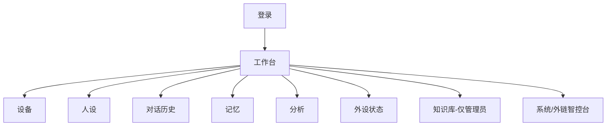

# 01 — 项目概述与信息架构

## 一句话

给开发者/内测用户一个**管理台**：管设备、定人设、看历史记忆、运营知识库——不是潮玩 App。

## 角色

| 角色 | 可见 |
|------|------|
| user | 自己的设备、人设、历史、记忆、分析、外设 |
| admin | 上述 + KB 编辑/发布 + 反馈审核 |

## 信息架构

## 非目标（首版）

日记 Feed、成长曲线、社交、NFC 换装、儿童模式完整体系。  
